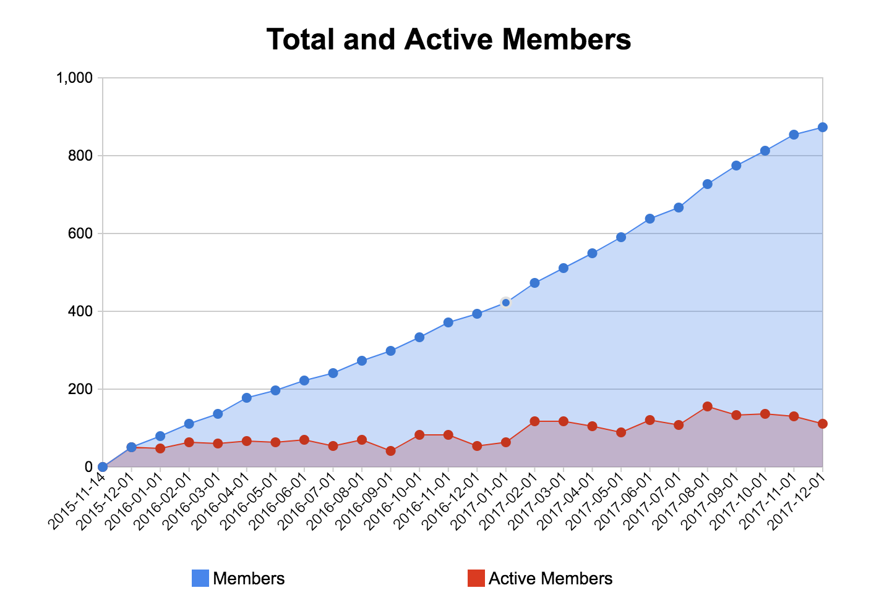
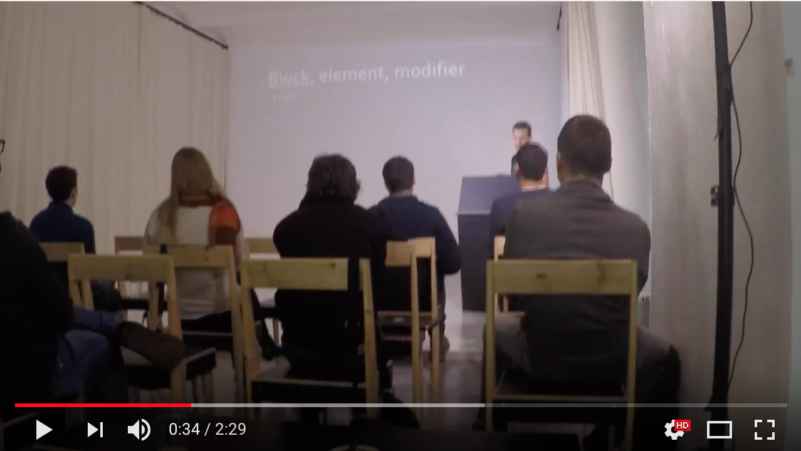
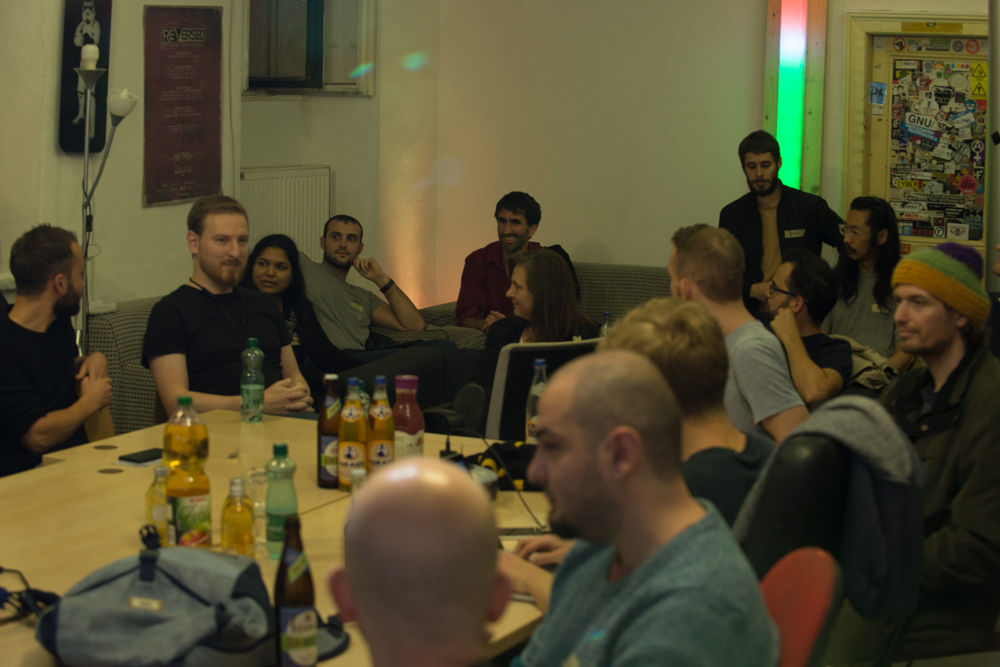
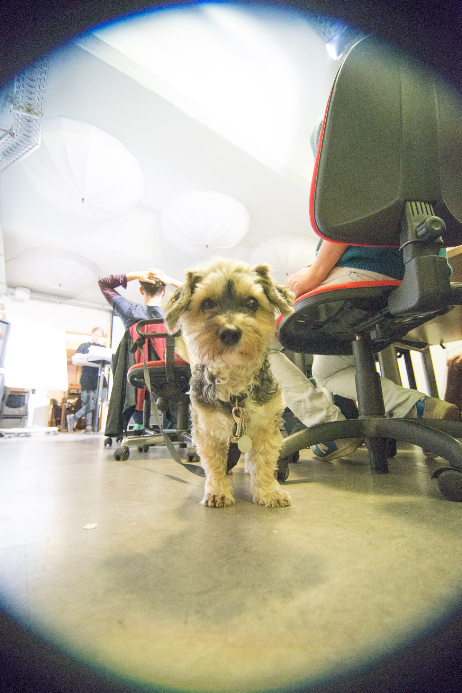
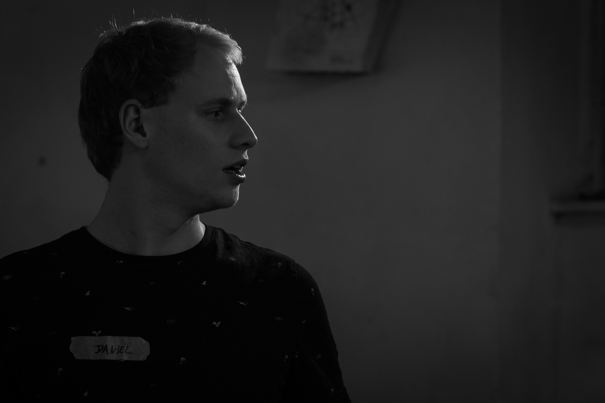
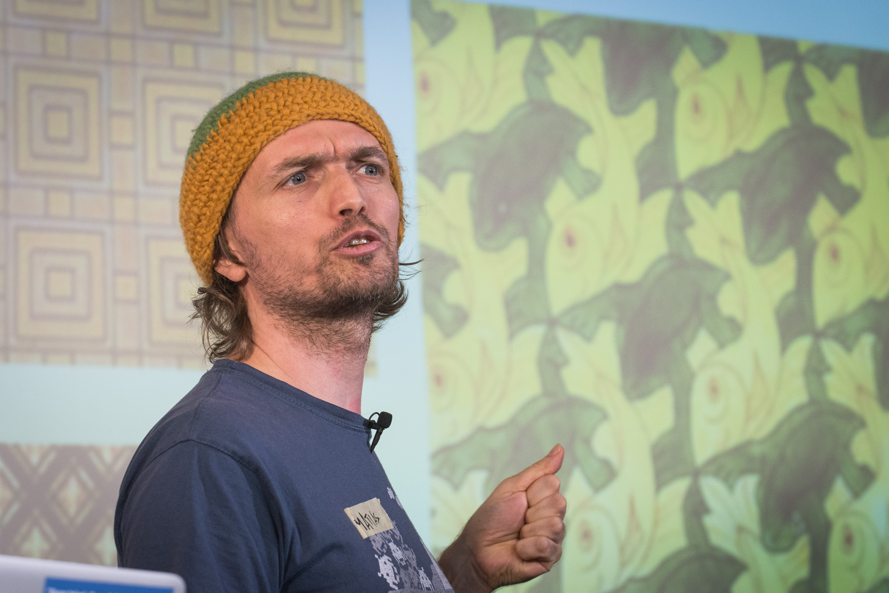
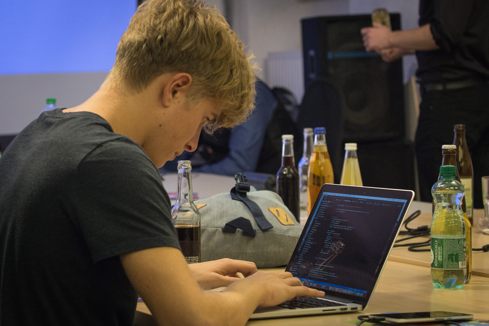
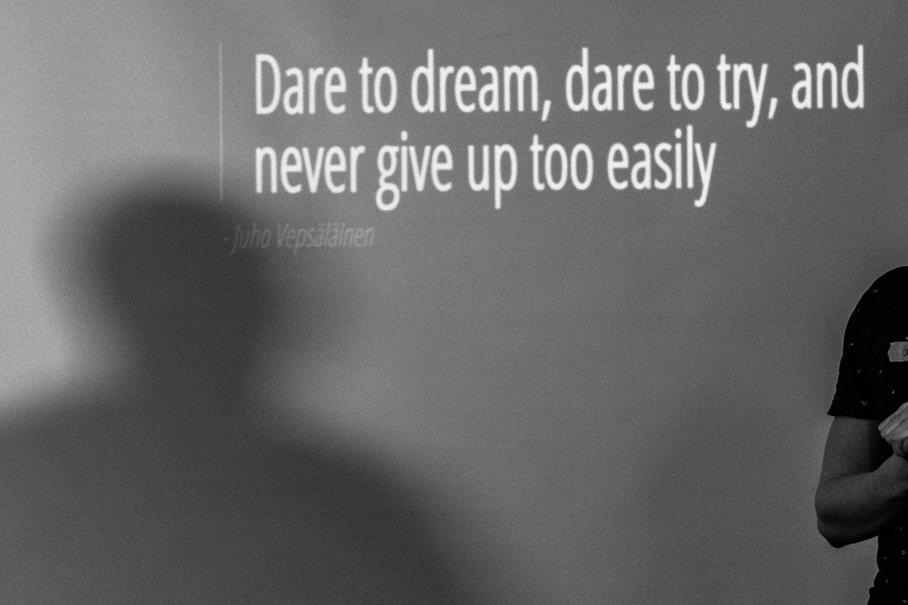
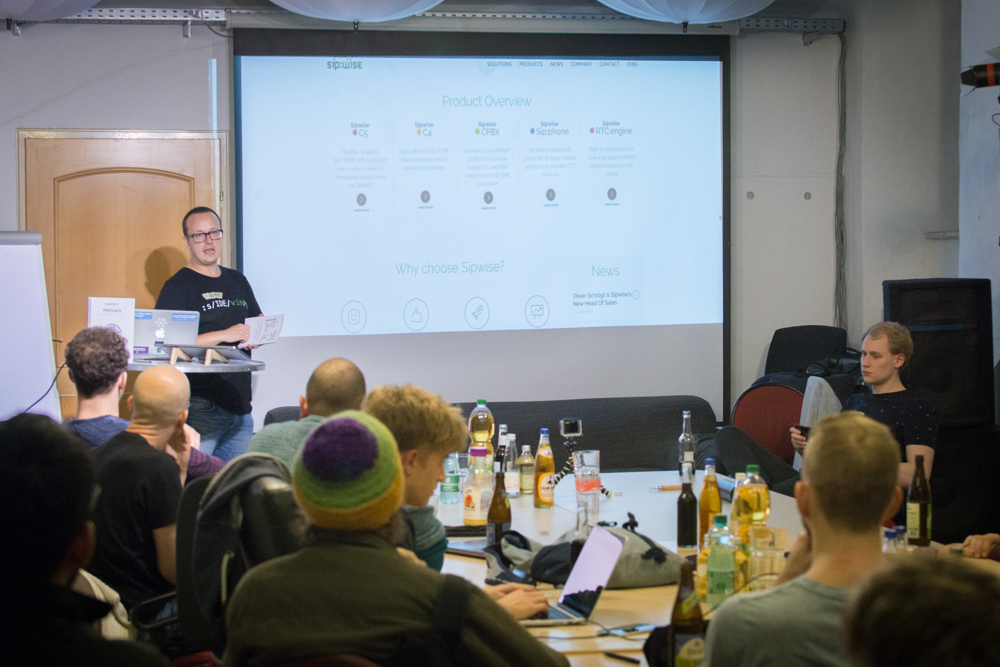

# Reflecting on Hosting Meetups in 2017

Photo by louis amal on Unsplash - https://unsplash.com/photos/ic6CAdKfDZQ

2017 comes to an end and it's time to reflect on the work I have done regarding non-profit work.

As soon as I learned the basics of programming with the help of [Free Code Camp](https://www.freecodecamp.com) I was eager to give something back. I figured out that I probably can do the most when strengthening the local group of the organization, helping individuals who are on the same path, and just provide a framework of exchange for these groups of people.

Even though I am doing more than just organizing a meetup I want to focus on the [FreeCodeCamp Local Meetup in Vienna](https://www.meetup.com/Free-Code-Camp-Vienna) in this article.

## 📄 Table of contents

  - [Short introduction about the meetup](#short-introduction-about-the-meetup)
  - [Why organizing events is great](#why-organizing-events-is-great)
  - [A take on non-profit systems and entities](#a-take-on-non-profit-systems-and-entities)
  - [What I have learned on a social side and thoughts on group work](#what-i-have-learned-on-a-social-side-and-thoughts-on-group-work)
  - [Stats and impressions](#stats-and-impressions)
  - [The future for events I organize](#the-future-for-events-i-organize)
  - [More about the events and organization](#more-about-the-events-and-organization)

---
>“Consuming culture is never as rewarding as producing it.” 
― Mihaly Csikszentmihalyi
---

## Short introduction about the meetup

[Robert Axelsen](http://rob.ee/) had the courage and took the initiative to start the local group in Vienna. Gladly, Robert is an amazing human being and we immediately connected. Since the start of this year we both organized the meetup and enjoyed all highs and lows of organizing a meetup.

The meetup itself currently focuses around collaborative coding, talks about programming, presentations of projects, updates and news from the development world.

## Why organizing events is great

Managing an organization is one of the most rewarding tasks I believe. Not because of the feedback you receive but rather because of the complexity of the task itself. When organizing meetups and events, one not only must handle event-specific tasks such as preparing locations, sponsors, talks and content, but also stay in contact with all people involved in the process and get yourself into the discussed topics as well. 

The complexity itself demands a lot from the organizer and schools him on many aspects of life. As I see it, it is the perfect preparation for starting a business. Although it can be hard to fit into the day-to-day schedule, it is perfectly doable when basics of time management are applied. 

Another thing why organizing events is great, is because it forces you to increase self-awareness, which is key in life in general. Knowing who you are, what your strengths and weaknesses are and how other people perceive you is very important to develop a better self.

Because how can you improve yourself if you are delusional about yourself?

## A take on non-profit systems and entities

During the journey it seemed necessary to formalize the work through a non-profit entity. 
This decision has to be made after careful due diligence. Setting up a business-like structure involves many new aspects in organizing such as: Correspondence to local authorities, being aware of legal pitfalls (especially regarding tax law and competition law ) and being liable to certain actions. 

It introduces and demands a new field of competence and expertise but also allows for additional rewards. Some of them are: 
- tax exemptions
- free use of various software, products and services
- possibility of official subsidies
- after the setup: way more organized way of handling business-like transactions

The takeaway here is to carefully audit the possible advantages and disadvantages and [always calculate with hidden costs](https://en.wikipedia.org/wiki/Planning_fallacy). 

## What I have learned on a social side and thoughts on group work

I have learned that people are really different. We have a variety of different people, from different countries, different fields of expertise, different social status and of course different personalities. 

That said, I think one of the most important abilities someone can have is to be flexible and adaptable to the situation. And that's another reason why organizing meetups is great - because you learn to be more and more flexible with people. 

I really started to understand this during a coding workshop we did. We wanted to keep it as flexible as possible to provide a good experience for all attendees. And even though we expected this could be difficult we witnessed astonishing results.

In the workshop we decided to divide  the attendees into 3 different groups and encouraged them to develop a project in a collaborative effort. Only one group was able to form a coherent group with ability to get into a flow and build a great project. 

I think what makes a good leader is to identify strengths and give those people social boundaries to allow them to unfold their potential. Every time a group is not able to get a workflow going it is either: 
- there is no leading authority in the group
- the leading authority is not competent enough

Randomly forming groups of people neglects the personality traits of each individual and therefore is prone to failure. There has to be an individual who is capable of taking on the lead, and also be competent enough to do it successfully. In a collection of random people the only way to increase the possibility of a successful outcome is to try to arrange the inhomogeneity of the group as high as possible, so that natural grouping can occur freely. 

## Stats and impressions

Photography by [Slaven Fanfani](https://moj.me/)

## The future for events I organize

I am very excited for the future. There are many ways to contribute to society. When organizing events and meetups is not really about showing off skills or projects or providing entertainment. For me it as a way to discover the skills and potential of people and empowering them. It is amazing how many people aren't aware of their own potential. So the goal for 2018 would be to increase self-awareness in people and help them harness their own power. 

I am a big believer that in the future there is a very big demand for people who know how to code. The future belongs to those who can control the machines which will ultimately direct our lives. 

Stay motivated! 

## More about the events and organization

- [FreeCodeCamp Vienna on meetup](https://www.meetup.com/Free-Code-Camp-Vienna)
- [FreeCodeCamp Vienna on Github](https://github.com/FCCVienna) and its [homepage](https://fccvienna.github.io/)
- [DevelopersRising on Github](https://github.com/DevelopersRising/DevelopersRising) and its [homepage](https://developersrising.herokuapp.com/)

---

Thanks for reading my article! Feel free to leave any feedback! 

---

<!-- Written by Daniel Deutsch (deudan1010@gmail.com) -->
