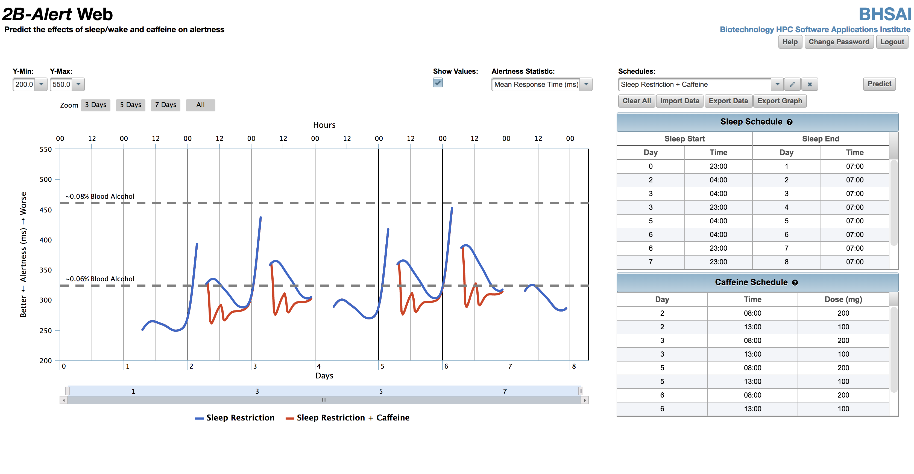

# Coffee and Code - A dosing strategy

Photo by Alex on Unsplash - https://unsplash.com/photos/VxtWBOQjGdI

I consider myself a productive person. Of course I like to drink caffeinated beverages to maximize my outcome. Recently I came across this article and thought it might be worth sharing my thoughts on it.

This article relies heavily on [this research paper](https://onlinelibrary.wiley.com/doi/epdf/10.1111/jsr.12711) and my personal experiences.

## Table of Contents

  - [Using an optimization algorithm?](#using-an-optimization-algorithm)
  - [My additional comments](#my-additional-comments)

## Using an optimization algorithm?

I refer to the [research paper on "Caffeine dosing strategies to optimize alertness during sleeploss"](https://onlinelibrary.wiley.com/doi/epdf/10.1111/jsr.12711) by Francisco G. Vital-Lopez, Sridhar Ramakrishnan, Tracy J. Doty, Thomas J. Balkin and Jaques Reifman. 

As they put it in the summary: 
> In this work, we provide an optimization algorithm, suited for mobile computing platforms, to determine when and how much caffeine to consume, so as to safely maximize neurobehavioural performance at the desired time of the day, under any sleep-loss condition

I assume that many ambitious people have once in their lifetime suffered from a form of sleep loss and therefore this findings can help to improve the use of caffeine. I most certainly was curious.

Since standard algorithms were not able to solve the optimization problem in a reasonable computational time they looked for an approximate solution using the tabu search algorithm.

The goal was a twofold optimization:
1. enhancing neurobehavioural performance and 
1. reducing caffeine consumption

Although the were able to come up with an algorithm, there were some problems to consider:
> However, there may be considerable individual variability in both the response to sleep loss and the restorative effects of caffeine. Variation in the effect of caffeine is, in part, a result of genetic polymorphisms in the genes coding for the main caffeine-metabolizing enzyme, P-450, and the main caffeine targets, adenosine receptors A1and A2A. To assess how well a group-average model captures individual differences, we computed the root mean squared error (RMSE) between the model predictions and the measured mean RT data from each subject after caffeine consumption.

And resulted in: 

> This result suggests that a group-average model cannot always be used to obtain optimal caffeine strategies at the individual level

Nevertheless, I like the idea very much. The combination of a validated mathematical model with optimization methods to determine when and how much caffeine to consume to achieve peak performance at the most needed times is very interesting.

Check out [their website](https://2b-alert-web.bhsai.org/2b-alert-web/login.xhtml) to use the algorithm on your schedule.

## My additional comments

I will try to alter my caffeine consumption and play a little bit with this. However this shall rather inspire to experiment with coffee consumption than only relying on these suggestions.

Too many things are not considered in this basic algorithm. 

I think that the average activity and how you spend your time is very important. As a programmer or student sitting around all day will probably have a different effect on you than being a professional athlete. 

What I personally found out to be helpful is to not drink coffee first thing in the morning as my body already seems to provide biochemical messengers to wake me up. Also any activity that does not require intense focus seems to be a waste for consumed caffeine. 

Therefore I drink my first coffee when I am in the transition to get some major coding/learning done. All meetings or activities with low cognitive effort shall be scheduled before my first coffee. 

The second coffee is not directly after lunch. Again, mostly because my body is already in a state of processing my consumed food. For me it's best about 2 hours after lunch, where I feel receptive to new stimulants. 

That's it. More coffee didn't really prove useful to me. (But I will keep experimenting)

What's also very important are breaks and enough sleep. Trying to compensate those essential ingredients with some sort of caffeine didn't help at all. Had a rather psychological than physical effect on me.

What's your strategy? Let me know! :) 

---

Thanks for reading my article! Feel free to leave any feedback! 

---

Daniel is a LL.M. student in business law, working as a software engineer and organizer of tech related events in Vienna. 
His current personal learning efforts focus on machine learning. 

Connect on:
- [LinkedIn](https://www.linkedin.com/in/createdd) 
- [Github](https://github.com/Createdd)
- [Medium](https://medium.com/@ddcreationstudi)
- [Twitter](https://twitter.com/DDCreationStudi)
- [Steemit](https://steemit.com/@createdd)
- [Hashnode](https://hashnode.com/@DDCreationStudio)

<!-- Written by Daniel Deutsch (deudan1010@gmail.com) -->