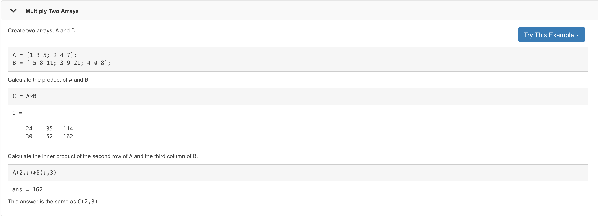
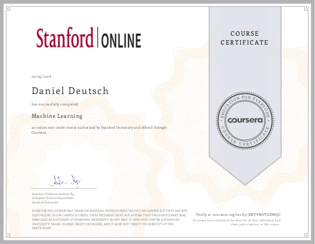

# Tips for finishing the Machine Learning course by Andrew NG on Coursera

Photo by SpaceX on Unsplash - https://unsplash.com/photos/uj3hvdfQujI

The Machine Learning course by Andrew Ng on Coursera is brilliant. I enjoyed it a lot. Andrew breaks complex topics down and makes them understandable for everyone. Since this course is definitely not easy I want to provide some tips for other students that are currently on this curriculum.

## Table of Contents

<!-- TOC -->

- [Tips for finishing the Machine Learning course by Andrew NG on Coursera](#tips-for-finishing-the-machine-learning-course-by-andrew-ng-on-coursera)
  - [Table of Contents](#table-of-contents)
  - [The complexity of the course](#the-complexity-of-the-course)
  - [The programming assignments](#the-programming-assignments)
    - [1. Read the documentation](#1-read-the-documentation)
    - [2. Use the debugging functionality](#2-use-the-debugging-functionality)
    - [3. Visualize matrices ( and variables )](#3-visualize-matrices--and-variables-)
    - [4. Read the information provided in the task](#4-read-the-information-provided-in-the-task)
  - [The quizzes](#the-quizzes)
  - [Formal requirements](#formal-requirements)
    - [Id verification](#id-verification)
    - [Payment](#payment)
  - [Mind the honor code](#mind-the-honor-code)

<!-- /TOC -->

## The complexity of the course

The complexity of this course is twofold. 
1. The content goes into depth of math and statistics
2. To make progress you have to finish quizzes and programming assignments

To fully grasp the use of all concepts in this course I think it is necessary to do more than just following along. Going though the course and finishing everything is just one step. I think the real value lies in revisiting all topics and trying to apply it to your own use cases. That's important to keep in mind.

## The programming assignments

This is tough. Especially if you are not familiar with programming. But even if you have no experience with any programming language, this course provides a soft introduction to it and allows to apply basic principles for powerful results.

I have used Matlab for all the challenges. I simply wanted to try it and thought there must be good documentation behind this product. And I wasn't disappointed.

### 1. Read the documentation

As someone who learned programming on his own, I have dealt with this problem before. One important thing is to READ THE DOCUMENTAION. This is always the most important step. 

For this course this applies for using Matlab features. The reason Matlab and Octave are recommended, is because they already offer a good variety of computing features with a solid performance. 

Let's take multiplying as illustration:

Matlab perfectly documents this [here](https://de.mathworks.com/help/matlab/ref/mtimes.html).

 (Source [Matlab Docs](https://de.mathworks.com/help/matlab/ref/mtimes.html))

When you are trying to multiply vectors ( and you are going to multiply many vectors ) just reading this documentation helps to prevent a lot of problems. ( As I often have encountered and seen in forums )

Especially as it says in the description: 

> "That is, A*B is typically not equal to B*A."

### 2. Use the debugging functionality 

Again, read the [documentation](https://de.mathworks.com/help/matlab/matlab_prog/debugging-process-and-features.html).

It is really easy and provides a lot of insight. 
- Just set a break point
- Run the program in the console ( otherwise arguments are not supplied to the functions )
- Hover over variables to see their values ( this is incredibly helpful with all the matrices )
- Adapt you code and re-run the previous steps

### 3. Visualize matrices ( and variables )

If debugging is not enough and you need a better visualization try to draw them out. This is especially useful when you have multiple errors in a longer formula calculation.

### 4. Read the information provided in the task 

The PDF file with the assignments contains not only valuable tips on how to solve a problem, but also gives sometimes Octave/Matlab syntax to simplify code. 
Be sure to read the assignments properly and the difficulty of the task is most of the times reduced significantly. 

## The quizzes

The quizzes are multiple- or single choice tests. 
You can retake a test 2 times and then you are blocked for 8 hours before being able to re-take the quiz again. 

Since there is no time pressure you can easily examine the course notes and documentation to read them again. Which is not only advisable but even encouraged. In my opinion this is when the learning starts. Being able to apply the learned material to different problems. 

Sometimes, as normal with multiple choice, the questions can be very tricky and confusing. Then re-taking the quiz might be helpful to come to a correct solution. ( Be aware that the questions and answers can change )

## Formal requirements

The following I found to be worth mentioning:

### Id verification

In order to get a certificate you need to [verify yourself](https://learner.coursera.help/hc/en-us/articles/209818953-Set-up-ID-verification). This ensures quality and credibility. Just finish the process and wait for review. 

If it takes too long you can send a mail to the support team, which resolves the issues very fast. ( In my case the support was fantastic! )

### Payment

## Mind the honor code 

https://learner.coursera.help/hc/en-us/articles/209818863

---

Thanks for reading my article! Feel free to leave any feedback! 

---

Daniel is a LL.M. student in business law, working as a software engineer and organizer of tech related events in Vienna. 
His current personal learning efforts focus on machine learning. Connect on:
- [LinkedIn](https://www.linkedin.com/in/createdd) 
- [Github](https://github.com/DDCreationStudios)
- [Medium](https://medium.com/@ddcreationstudi)
- [Twitter](https://twitter.com/DDCreationStudi)
- [Steemit](https://steemit.com/@createdd)
- [Hashnode](https://hashnode.com/@DDCreationStudio)

<!-- Written by Daniel Deutsch (deudan1010@gmail.com) -->