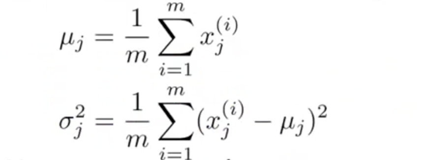
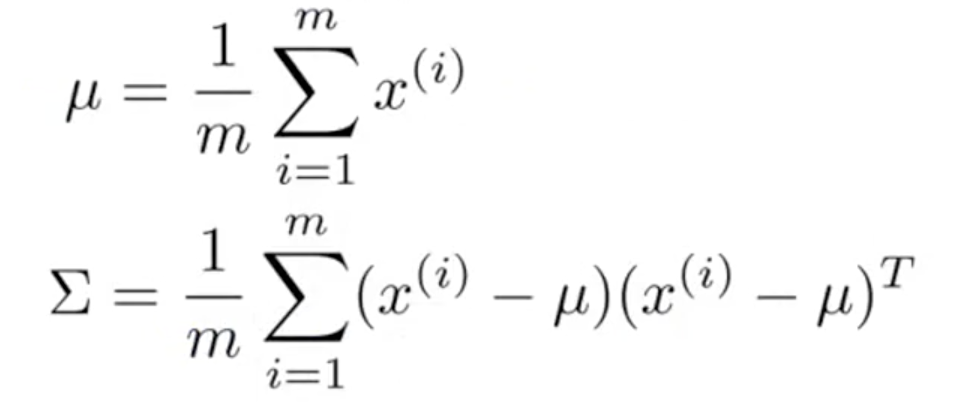
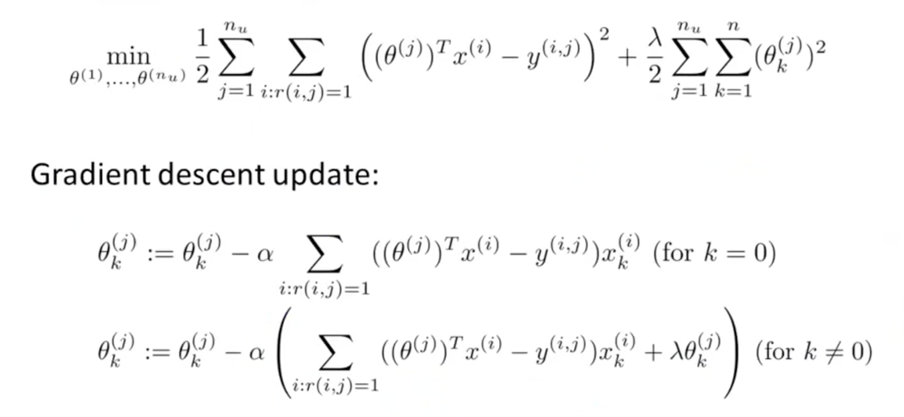

# Machine Learning Basics - Part 4 - Anomaly Detection, Recommender Systems and Scaling

Photo by Fahrul Azmi on Unsplash - https://unsplash.com/photos/vR-Nb0bncOY

In this article I revisit the learned material from the amazing [machine learning course by Andre Ng on Coursera](https://www.coursera.org/learn/machine-learning) and create an overview about the concepts. The article is not designed as a tutorial but rather to fresh up on the basic ideas.

All quotes refer to the material from the course if not explicitly stated otherwise.

## Table of Contents
<!-- TOC -->

- [Machine Learning Basics - Part 4 - Anomaly Detection, Recommender Systems and Scaling](#machine-learning-basics---part-4---anomaly-detection-recommender-systems-and-scaling)
  - [Table of Contents](#table-of-contents)
  - [Anomaly detection](#anomaly-detection)
    - [Develop a Anomaly Detection system](#develop-a-anomaly-detection-system)
    - [Practical Tips and difference to a supervised learning system](#practical-tips-and-difference-to-a-supervised-learning-system)
    - [Multivariat Gaussian distribution](#multivariat-gaussian-distribution)
  - [Recommender Systems](#recommender-systems)

<!-- /TOC -->

## Anomaly detection

Anomaly detection tests a new example against the behavior of other examples in that range. This idea is often used in fraud detection, manufacturing or monitoring of machines. It is always useful if the goal is to detect certain outliners.

Using a Gaussian distribution algorithm implies that the example x is distributed with a mean Mu and variance Sigma squared.

The formula for Mu and Sigma squared are:

The formula for calculating the probability is:

The steps to build the algorithm are
1. Choose the features x that might be indicative of anomalous examples
1. Calculate the parameters Mu and Sigma
1. Compute the probability p of x
1. Test against your set probability boundary Epsilon

### Develop a Anomaly Detection system

When the algorithm is implemented it is important to introduce a real-number evaluation metric.

As always it is advisable to split the data set into a training, cross-validation and testing set(60-20-20). 

The steps to build the system would be:
1. Fit the model p(x) on the training set
1. Predict the y on the resulting probabilities of your cross-validation and testing sets
1. Evaluate the result using a contingency table (true positives, false positives, ...), precision/recall methods or the F1-score
1. change values of Epsilon (if necessary)

### Practical Tips and difference to a supervised learning system

An anomaly detection system should be used if
- a large number of negative examples but a small number of positives examples are available
- the anomalies themselves cannot be classified and may vary in future examples
- eg. fraud detection, monitoring machines, etc.

If a classification can easily be done, ie having large numbers of positive and negative examples and future examples will be similar, it is advisable to use a supervised learning algorithm. (eg SPAM, cancer classification)

To analyse errors it makes sense to plot the features and see if they behave Gaussian. If not, constants (like log(x)) can be added, to try to make it look as Gaussian as possible. 

The basic assumption for using anomaly detection system is to have few anomalous examples and many normal ones. If this is not met, the misclassified example should be inspected for behavior that allows to come up with a new feature.

### Multivariat Gaussian distribution

In certain cases the normal Gaussian distribution is not enough the accurately flag anomalies. 
A multivariat Gaussian distribution calculates the probability model of x at once, instead of model the probabilities for each feature alone. It uses a covariance matrix instead of Sigma squared.

The formula looks like:

Whereas: 

The multivariate Gaussian model is worth to be considered when the number of examples is much larger than the number of features. It captures correlations between features but is computational expensive. When it is obvious what feature combinations can capture the anomalies, it is advisable to  first implement those with the original Gaussian model.

## Recommender Systems

A recommendation system is one of the most common and most successful practical examples for applying a machine learning algorithm in real life. 

Assuming you have a content-based recommender system. First, a problem has to be formulated. This can be something like predicting the rating of a certain product of a certain user. 

The optimization algorithm can look like this:

- the parameters theta denote a vector for a certain user
- the feature x denotes a vector for a movie 
- y denotes the rating by a certain user on a certain movie
- n denotes the number of users

This is the basic cost function of a squared error with regularization summed up for different users (theta j).

And using gradient descent (multiplying the learning rate alpha with the partial derivative with respect to your parameter of the optimization objective) to gradually minimize the result. Note that theta 0 for k = 0 should not be regularized (as described in linear regression). 

---
 
This wraps up the third part. In the next one, anomaly detection, recommender systems and scaling issues will be described. Stay tuned!

---

Thanks for reading my article! Feel free to leave any feedback! 

---

Daniel is a LL.M. student in business law, working as a software engineer and organizer of tech-related events in Vienna. 
His current personal learning efforts focus on machine learning. 

Connect on:
- [LinkedIn](https://www.linkedin.com/in/createdd) 
- [Github](https://github.com/DDCreationStudios)
- [Medium](https://medium.com/@ddcreationstudi)
- [Twitter](https://twitter.com/DDCreationStudi)
- [Steemit](https://steemit.com/@createdd)
- [Hashnode](https://hashnode.com/@DDCreationStudio)
