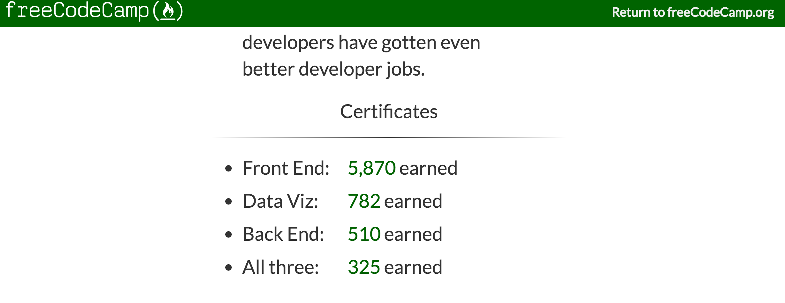
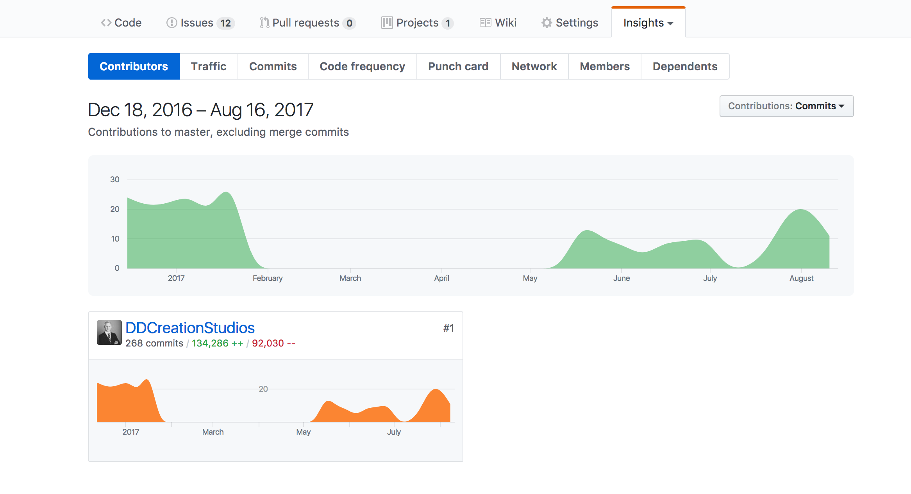
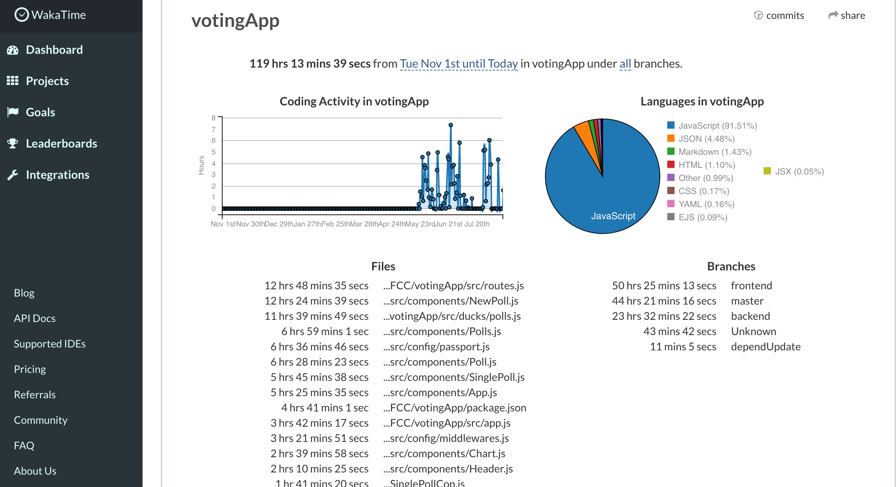
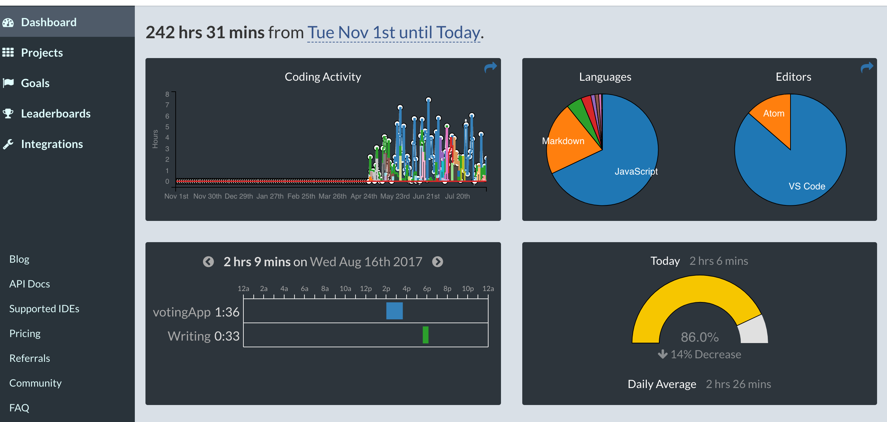

# Learnings from my first full stack app in JavaScript

Photo by Hugo Sousa on Unsplash

The [FreeCodeCamp Curriculum](https://www.freecodecamp.org/challenges/build-a-voting-app) qualifies the voting app as an advanced backend challenge. However I didn't really understand that qualification, since all user stories are pointing to a full stack app. Here are some of my findings when tackeling this app. These can be especially revealing for coding beginners, who are on the same path.

[➡️ Github Repo is available here ⬅️](https://github.com/DDCreationStudios/votingApp)

## 📄 Table of contents

- [A little background](#a-little-background)
- [Some data](#some-data)
  - [Numbers:](#numbers)
  - [Putting it into perspective](#putting-it-into-perspective)
- [General and motivational takeaway](#general-and-motivational-takeaway)
- [Developer beginner takeaways](#developer-beginner-takeaways)

---
>“Tell me and I forget, teach me and I may remember, involve me and I learn.” - Ben Franklin
---

## A little background

Seeing the achieved certificates at the FreeCodeCamp about page, I understood that the backend certificate must be hard to accomplish. 

In short, this curriculum (and it will be renewed in near future) requires for the first advanced backend challenge practically a full stack app. 

I completely started from zero, so this was a real challenge. That's why I also decided to track a little bit and describe some things for other students that encounter the same frustrations on this challenge that I did.

## Some data

Before describing my key learnings I want to provide some data.

I gathered the data with [WakaTime](https://wakatime.com/i/cfaa854f-8e87-484b-9023-b8ba1d660e85), which can easily be integrated in your editor and tracks your time you spend on Repos. 

Unfortunately I have discovered it pretty late, in May actually, which leads to a very undertracked result. 

Looking on [Github](https://github.com/DDCreationStudios/votingApp/graphs/contributors) I was already starting with that project in December 2016. 

---

So keep in mind that even the data I am showing doesn't come close to my real efforts!

---

### Numbers:

- I was spending around 120 hours on this app.
- Most of it (13hours) was spent creating the routes file. Basically implementing the REST API.
- Second place with 12 hours spent, was the NewPoll.js file for the frontend. This was due to the efforts integrating a new poll in the React & Redux eco system, which brings me to the 3rd place.
- With 12 hours on the ducks for Redux. The ducks file contains most code related to Redux, ie. ActionCreators, Actions, Reducers. Immutable state and asynchronous actions cost so much time to understand and implement correctly.

[See the WakaTime results yourself.](https://wakatime.com/@cfaa854f-8e87-484b-9023-b8ba1d660e85/projects/uleadaknfi?start=2016-11-01&end=2017-08-16)

Again, especially for beginners of interest, my overall time spent coding from May till now (mid August):

- I spent somewhere around 240 hours coding in that timeframe
- most of it in JavaScript 
- most of it using Visual Studio Code
- on an average of 2 hours per day

### Putting it into perspective

Remember that this is only a very small scope of my efforts. 
- This is on Github. 
- Tracked too late with WakaTime. 
- Just tracking time in the editor actually coding.  

Alone from the Github Repo you can see, that I have easily spent more than 200 hours on this application. Here you also have to take into account that I was learning a lot on the way - so I actually was improving a lot and becoming much faster with the time.

I was also doing other tutorials and projects, watching videos and writing articles on the side to understand concepts better.

## General and motivational takeaways

Maybe this sounds a lot to you, maybe it sounds not much for you. Doesn't matter. Key thing here is to see how things can be quantified in the development area. 

Spending more than 250 hours coding (+ side projects and code at work) in 4 months leads to approximately 60 hours per month and to 15 hours per week. 

So when you want to embark on this journey and you see people spending months on projects, keep those numbers in mind. 

See what it takes to progress in an area you had no idea or knowledge of. These underestimated 15 hours are equal to a part time job. So if you think that progress is slow and poor, realize what it takes. 

I am no genius, but certainly not dumb. (At least according to some tests :D)

See that consistency is everything. 
You can't do a project like this on one weekend. Make yourself aware how long the journey is. Realize that it is hard and remind yourself where you are going. Constantly!

## Code beginner takeaways

Analyzing the [app](https://github.com/DDCreationStudios/votingApp) a little bit in depth you will realize it is pretty unfinished. I myself have openend issues and see many things to improve. 

Now why is that?

For me, each project has it's own key learnings. In this project it was the connection of frontend and backend and using Redux in React. To keep my eyes on the learning path I force myself to tackle the next app. Reuse the things I have learned and be able to see new problems in a different light. 

Continuing this app and powering it up with more features, more functionality and tests would take a lot of time but diminish my learning results. 
It's open source and always available. If I want to continue my work I can do it easily. 

## Links

- Repository on Github is available [here](https://github.com/DDCreationStudios/votingApp).
- Live version of the result is available [here](https://ddcs-votingapp.herokuapp.com/).
- Documentation of the building process [here](
https://github.com/DDCreationStudios/Writing/blob/master/articles/VotingApp.md).

Thanks for reading my article! Feel free to leave any feedback! 

---

## Many, many thanks to [Edo Rivai](https://twitter.com/EdoRivai), who gave very valuable tips for the app along the way. :) 

---

<!-- Written by Daniel Deutsch (deudan1010@gmail.com) -->
