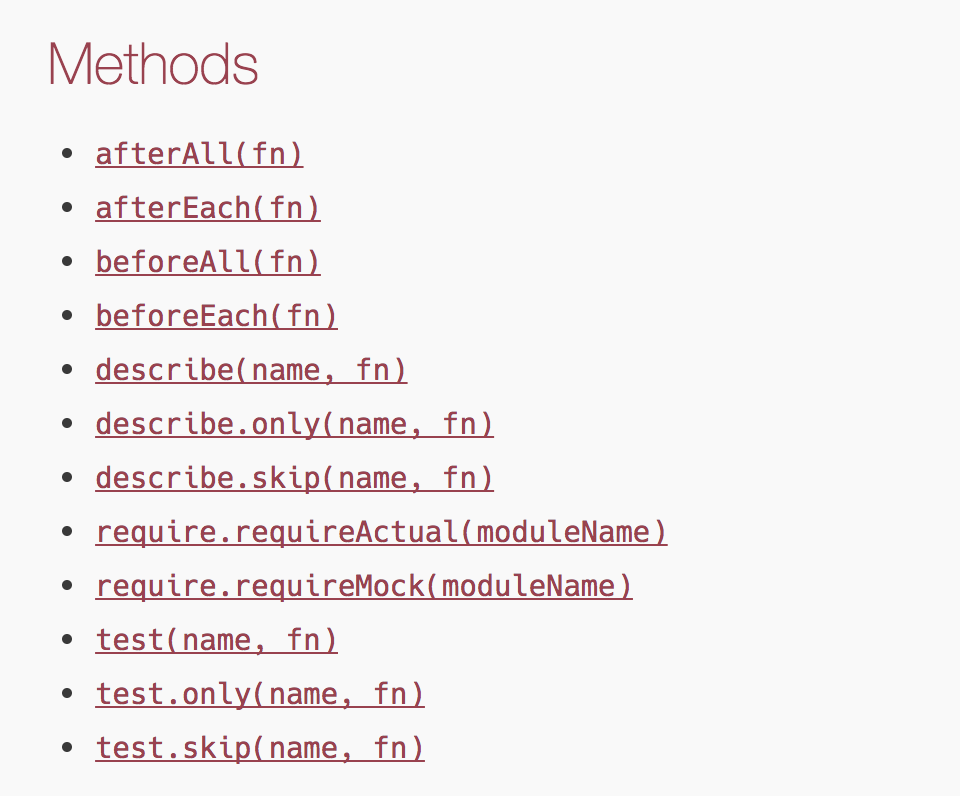
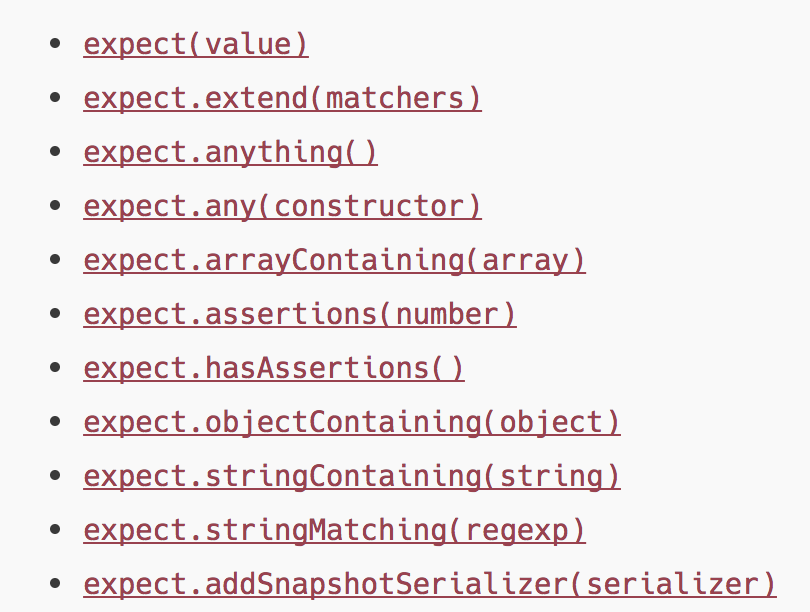
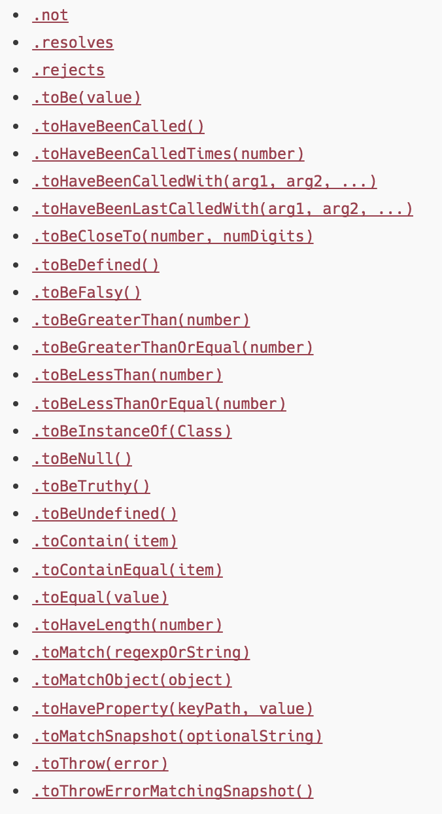

# asdasfas

Photo by Demi DeHerrera on Unsplash - https://unsplash.com/photos/L-sm1B4L1Ns

[➡️ Github Repo is available here ⬅️](https://github.com/DDCreationStudios/RESTAPIIntro)

## 📄 Table of contents

---
>"dsasfasfasf"  - Bezos
---

## Jest API

One of the reasons Jest gets more and more popular is the straight-forward and easy API.

Their global methods are: 

||
|--|
|
|

Their expect / matcher methods are:

|||
|---|---|
|||

## Enzymes methods

#### Shallow rendering

This is used to test the component on it's own. Isolated from other components. This is especially useful for testing representational or "dumb" React components.

As [their docs](http://airbnb.io/enzyme/docs/api/shallow.html) say:
> Shallow rendering is useful to constrain yourself to testing a component as a unit, and to ensure that your tests aren't indirectly asserting on behavior of child components.

#### Full rendering

#### Static rendering

## Useful links & credits
- [📄 "Begin"](afgafgadgads)

Thanks for reading my article! Feel free to leave any feedback! 

<!-- Written by Daniel Deutsch (deudan1010@gmail.com) -->
