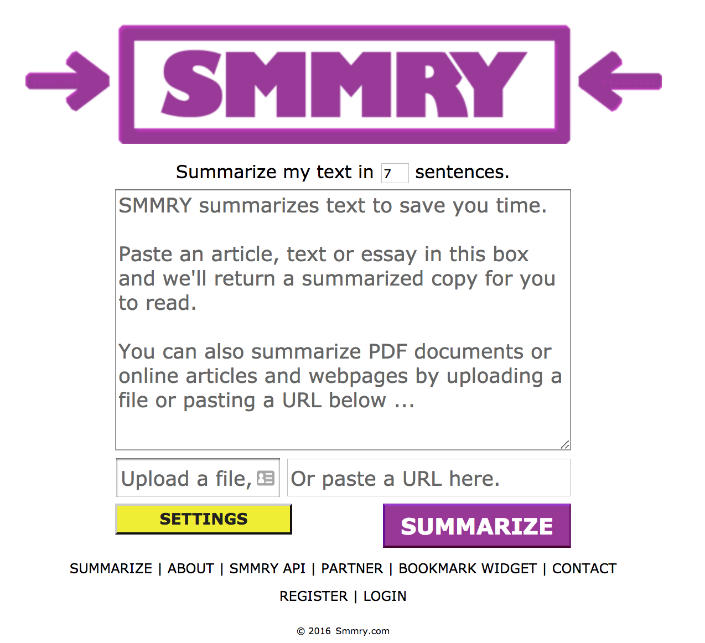

# asdasfas

Photo by Daniil Kuželev on Unsplash - https://unsplash.com/photos/QRawWgV6gmo

I am a law student and always need to go through huge amounts of text. On my way to learn more natural language processing I came across text summarizing. Here is a list of some online summarizers. Enjoy.

## 📄 Table of contents

<!-- TOC -->

- [asdasfas](#asdasfas)
  - [📄 Table of contents](#📄-table-of-contents)
  - [SMMRY](#smmry)
    - [What it does](#what-it-does)
    - [How it works](#how-it-works)
  - [Useful links & credits](#useful-links--credits)

<!-- /TOC -->

---
>"dsasfasfasf"  - Bezos
---

## SMMRY

[SMMRY](http://smmry.com/)

### What it does

- Ranking sentences by importance using the core algorithm.
- Reorganizing the summary to focus on a topic; by selection of a keyword.
- Removing transition phrases.
- Removing unnecessary clauses.
- Removing excessive examples.

### How it works

- Associate words with their grammatical counterparts. (e.g. "city" and "cities")
- Calculate the occurrence of each word in the text.
- Assign each word with points depending on their popularity.
- Detect which periods represent the end of a sentence. (e.g "Mr." does not).
- Split up the text into individual sentences.
- Rank sentences by the sum of their words' points.
- Return X of the most highly ranked sentences in chronological order.

[Source](http://smmry.com/about) 

## Useful links & credits
- [📄 "Begin"](afgafgadgads)

Thanks for reading my article! Feel free to leave any feedback! 

<!-- Written by Daniel Deutsch (deudan1010@gmail.com) -->